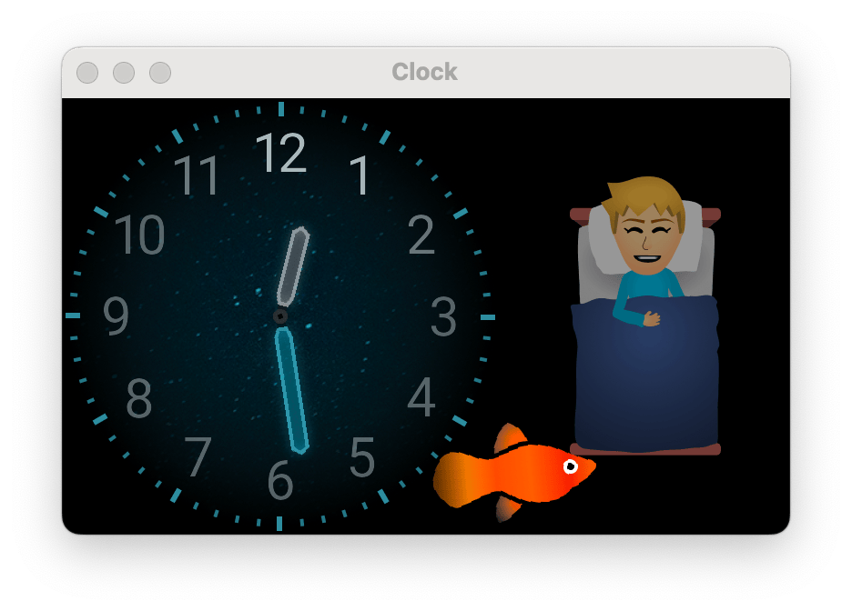

# Clock

A "smart" clock written in [Go](https://golang.org) which runs on a [4.0 inch screen](https://shop.pimoroni.com/products/hyperpixel-4) connected to a [Raspberry Pi](https://www.raspberrypi.org/)



## Goal

- Show time
- Alarm (for School)
- Show train delays

## Setup

```sh
go install github.com/bokwoon95/wgo@latest
apt-get install libsdl2{,-mixer,-image,-ttf,-gfx}-dev
go get -v github.com/veandco/go-sdl2/{sdl,img,ttf}
go get -v github.com/bfanger/clock
```

## MacOS dev setup

```
brew install pkg-config sdl2 sdl2_image sdl2_ttf
```

## Architecture / Design

An abstraction on top of SDL to make an efficient event-based ui.

### Lazy execution

Allow work is deferred until the results are needed. This allows freely changing individual properties of a layer without causing an updated texture for every change.

The actual work is performed when a `Image(\*sdl.Renderer)` via `Compose(\*sdl.Renderer)` is called.
The resulting texture is cached, so drawing the next frame will be even faster.

### Concepts

```go
type Imager interface {
  Image(r *sdl.Renderer) (*Image, error)
}
```

An `Imager` can generate a image/texture based on it's properties.
It doesn't have a position and can't be displayed on its own.

```go
type Composer interface {
  Compose(*sdl.Renderer) error
}
```

To display something in the renderer you'll need a Composer.
The Composer is responsible for rendering the texture(s) onto the screen

#### Engine

Composers are added to a Scene in the Engine and are rendered automatically.
All UI operations should be wrapped in a `engine.Go()` closure which are batched and executed in the main/ui thread.
A useful side-effect of calling engine.Go is that it will trigger a re-render.

# Getting latest SDL on Raspberry OS

Download latest [libsdl2 source](https://github.com/libsdl-org/SDL/releases)
(2.32.10 at the time of writing)

```sh
tar -xvf ./SDL2-2.32.10.tar.gz
cd SDL2-2.32.10
sudo apt install libdirectfb-dev
./configure --disable-video-rpi --enable-video-directfb
make
sudo chown -R pi /usr/local
make install
```

Download [SDL_image](https://github.com/libsdl-org/SDL_image/releases)

```sh
sudo apt install libjpeg-dev libtiff-dev
tar -xvf ./SDL2_image-2.8.8.tar.gz
cd SDL2_image-2.8.8
./configure
make
make install
```

and [SDL_ttf](https://github.com/libsdl-org/SDL_ttf/releases)

```sh
tar -xvf ./SDL2_ttf-2.24.0.tar.gz
cd SDL2_ttf-2.24.0
./configure
make
make install
```

Remove the packaged version:

```sh
sudo apt-get remove libsdl2{,-mixer,-image,-ttf,-gfx}-dev
sudo apt-get remove libsdl2{,-mixer,-image,-ttf}-2.0
```
